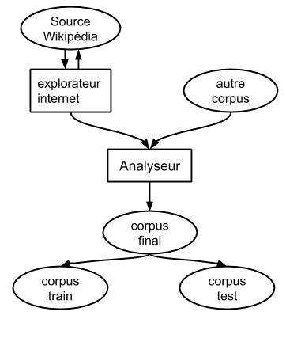
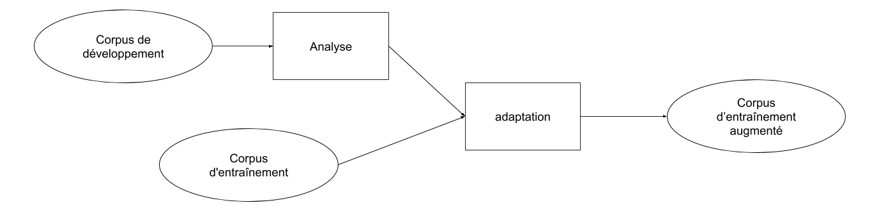

## Modèle IRIT

### Generation du graphe de transcription

Le script run.sh permet de réaliser toute les opérations nécessaires à la création du graphe de reconaissance final : de la récupération du corpus wikipédia a l'assemblage des différents graphes. Avant de lancer ce script, plusieurs étapes sont nécessaires :

#### ETAPE 1

changer le chemin vers kaldi dans le script path.sh

```bash
export KALDI_ROOT=<YOUR_KALDI_PATH>
```

#### ETAPE 2

Spécifier les chemins d'accès vers les différents dossiers/fichiers au debut du script run.sh :

* corpus_path : Chemin vers le corpus d'entraînement du modèle de langage
* g2p : Chemin vers le modèle graphème to phonème
* locdata : chemin vers les données locales
* locdic : chemin vers le dossier du dictionnaire (Il doit contenir le dictionnaire fr.dict)
* loclang : chemin vers le repertoire temporaire pour la preparation du modèle de langage
* lang : chemin vers le repertoire pour la generation du modèle de langage
* lang_test : chemin vers le repertoire pour le test du modèle de langage (doit etre différent de lang)
* acoustic chemin vers le répertoire contenant le modèle acoustique
* no_kill : chemin vers le fichier contenant le texte utilisé pou l'optimisation:
* generic_lm : Chemin vers le modèle de langage a utiliser pour l'interpolation (format du modele : .gz)

#### ETAPE 3

Choisir les options d'entrainement en mettant a 1 ou a 0 les variables suivantes : 
    - wiki_crawl : permet de crawler un corpus sur Wikipedia
    - pretraitement : permet d'activer la mise en forme du corpus
    - interpolation : permet d'effectuer l'interpolation du modele de langage genere avec le modele specifie dans la variable generic_lm.
    - optimisation : permet d'effectuer l'optimisation de la perplexité par rapport au texte contenu dans la variable nokill

#### ETAPE 4

Placer le(s) corpus textuel(s) que l'on souhaite utiliser pour l'entrainement du modèle de langage dans le dossier corpus_path et modifier le script run.sh afin d'assembler le corpus d'apprentissage du modèle de langage à partir des différentes sources. 

```bash
cat $corpus_path/corpus_part1.txt $corpus_path/corpus_part2.txt  > $corpus_path/CORPUS.txt
```

Si l'étape de récupération de données Wikipédia à été effectuée, penser à ajouter le fichier raw_database.txt qui se trouve dans le dossier $corpus_path dans la commande précédente.

#### Etape 5

Placer le modèle acoustique à utiliser (les fichiers final.mdl et tree) dans le dossier $acoustic.


#### Etape 6

Lancer le script run.sh
```bash
./run.sh
```

Le graphe de transcription HCLG.fst généré se trouvera dans le dossier :

```bash
$export_dir/graph
```


### Fonctionnement Général
#### Génération du corpus d'apprentissage du modèle de langage
La génération du corpus d'apprentissage du modèle de langage selon le schéma suivant :

<div style="text-align:center">
  
</div>

Un explorateur web va récupérer des pages wikipedia a partir de pages "racine" définies par l'utilisateur au début du script `scripts/wikipedia-crawler/wiki-crawler.py`. Ces pages "racine" permettent d'orienter la recherche de textes vers des thèmes précis en fonction du contexte du discours à transcrire. Cet explorateur récupère 200 pages par page "racine".

ATTENTION : La récupération des pages peut être très longue, il est recommandé de ne l'effectuer qu'une seule fois.

Les pages Wikipédia récupérées sont ensuite associés avec des corpus existants (corpus ajoutés dans le dossier `$corpus_path`) avant d'être traitées avec un analyseur afin de supprimer les caractères spéciaux, adapter les abbréviations et mettre une seule phrase par ligne.

Une fois ce prétraitement terminé, le corpus traité est divisé en un ensemble d'entrainement (80% des phrases) et un ensemble  de test (20% des phrases).

##### Adaptation au contexte

Afin d'obtenir une meilleure perplexité du modèle de langage, On utilise un corpus composé d'une partie des transcriptions des audios. On utilise ces textes afin d'adapter le contenu du corpus d'entrainement à ce que l'on doit transcrire. Cette adaptation est réalisée selon le schéma suivant :

<div style="text-align:center">
  
</div>

Cette étape correspond a une analyse du corpus de développement (on regarde le nombre d'occurence des différents n-grams) ensuite on va dupliquer le nombre d'occurences des n-grams apparaissant le moins dans le corpus d'entraînement. Cela aura pour effet de diminuer la perplexité du modèle de langage.

#### Génération du graphe de reconaissance final

Afin de procéder à la reconaissance de parole, il est nécessaire de génerer un graphe appelé HCLG.fst. Grossièrement, ce graphe combine le modèle de langage (représentation de la langue), le lexique ou dictionnaire et le modèle acourstique. La génération de ce graphe se fait de la manière suivante :


##### Entrainement du modèle de langage

Une fois que le corpus bien en place, on peut passer à l'entrainement du modèle de langage.  Le modèle de langage entrainé est un 3-gram. Pour cela, on utilise SRILM et la commande :

```bash
ngram-count -order 3 -write-vocab vocab-full.txt -text corpus.txt -lm lm.gz
```

Cette fonction permet d'entrainer le modèle de langage ainsi que d'enregister tous les mots du corpus d'entrainement.

##### Gestion des mots hors vocabulaires
Nous disposons d'un dictionnaire phonetique. Il se peut que certains mots du corpus d'apprentissage ne soient pas présents dans ce dernier. Il va donc falloir générer leur phonétisation. Pour ce faire, on utilise un algorithme graphème to phonème (G2P) qui permet de génerer une phonetisation des mots.

Afin de limiter les erreurs possibles de phonetisation, un filtrage des mots hors vocabulaire est nécessaire. En effet, des mots hors vocabulaire ne sont pas des mots de la langue française et ne sont donc pas nécessaires dans notre contexte de reconaissance. De plus, ils peuvent causer une creation de phonèmes inexistants par le modèle G2P lorsque ce dernier n'arrive pas à génerer un résultat correct. Dans un premier temps, on ne va donc conserver que les mots hors vocabulaire qui sont présent dans le corpus No kill.

Avant de passer à l'étape suivante, il faut s'assurer que les phonèmes générés par l'algorithme G2P soient des phonèmes présent dans le dictionnaire.

##### Génération des graphes L.fst et G.fst et compilation du graphe HCLG.fst

Afin de générer le graphe de reconaissance final HCLG.fst, nous allons dans un premier temps générer les graphes L.fst et G.fst. Avant de génerer le graphe L.fst, il est nécessaire de préparer un fichier contenant la liste des phonèmes. Une fois ce fichier créé, il est possible de génerer le graphe en utilisant la recette Kaldi développée pour le corpus du Wall Street Journal en executant la commande suivante :

```bash
scripts/prepare_lang.sh <dict-src-dir> <oov-dict-entry> <tmp-dir> <lang-dir>
```

Une fois le graphe L.fst généré, nous allons pouvoir passer à la génération du G.fst. Pour cela nous allons formater le modèle de langage afin de le le passer du format ARPA en FST, encore en utilisant un script de la recette Kaldi développée pour le corpus Wall Street Journal :

```bash
utils/format_lm.sh <lang_dir> <arpa-LM> <lexicon> <out_dir>
```

Enfin, on peut passer à la génération du modèle HCLG.fst. Pour cela on execute le script suivant:
```bash
utils/mkgraph.sh [options] <lang-dir> <model-dir> <graphdir>
```

Une fois le graphe final créé, il est possible d'effectuer la reconaissance.
