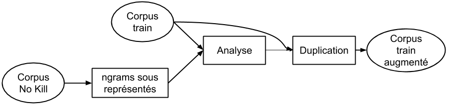

# NoKill_ASR
Ce dossier contient le code necessaire pour effectuer de la reconaissance automatique de la parole. Ce dossier à été créé suite à un stage réalisé de juin à septembre 2019  à l'Institur de Recherche en Informatique de Toulouse (IRIT) dont l'objectif etais de réaliser un système de reconnaissance automatique de la parole aui serait utilisé pour une pièce de théâtre par la compagnie No Kill (http://cienokill.fr/spectacles/turing-test/).

Deux approches ont été utilisées : la première est l'utilisation de l'API Speech To Text développée par Google, la seconde est l'utilisation de  modèles développés à l'IRIT.

Le dossier contiens des codes python 2 et 3 permettant d'éffectuer la reconaissance mais aussi de créer un corpus dans le but d'entraîner un modèle de langage, effectuer l'entraînement de ce dernier et de génerer le graphe permettant la reconaissance

## Avant de commencer

Il est recommandé Ubuntu, en effet certains packages nécessaires ne sont disponibles que sur cette plateforme.

### Prérequis

#### Python 3
Python 3 n'est utilisé que pour l'utilisation de l'API Google. Afin de pouvoir utiliser les scripts présentés, il va falloir installer les packages python 3 suivants :
* pyaudio (https://pypi.org/project/PyAudio/#description)
* pydub (https://pypi.org/project/pydub/)
* google-cloud-speech (https://cloud.google.com/speech-to-text/docs/quickstart-client-libraries#client-libraries-install-python)
* webrtcvad (https://pypi.org/project/webrtcvad/)

#### Python 2
Python 2 est utilisé pour la génération du corpus, l'entrainement du modèle de langage ainsi que la composition du modèle final. Les packages suivants sont requis :
* beautifulsoup (https://pypi.org/project/beautifulsoup4/)
* num2words (https://pypi.org/project/num2words/)
* unidecode (https://pypi.org/project/Unidecode/)
* unicodedata

#### Système
Afin d'entraîner le modèle de langage, il va falloir installer dans un premier temps Kaldi (https://github.com/kaldi-asr/kaldi)
Puis insaller SRILM dans Kaldi. Pour ce faire Télecharger SRILM renomer l,archiive télechargée srilm.tgz et la placer dans le fichier kaldi/tools/ . Enfin, executer le scipt kaldi/tools/install_srilm.sh

Pour effectuer la phonetisation des mots hors vocabulaires, Il est necessaire d'installer Phonetisaurus (https://github.com/AdolfVonKleist/Phonetisaurus#phonetisaurus-g2p)

## API Google Speech to Text

Avant de lancer les scripts de transcriptions utilisant l'API Google, il est nécessaire de créer un fichier JSON permettant de s'identifier auprès de Google (https://cloud.google.com/video-intelligence/docs/common/auth?hl=fr). Dans les scripts il est nécessaire de modifier la ligne suivante en précisant le chemin vers le fichier JSON téléchargé depuis Google Cloud :
```python
os.environ["GOOGLE_APPLICATION_CREDENTIALS"]="<your_key>.json"
```

Une fois le chemin vers le fichier JSON établi, il suffit de lancer les scripts de la manière suivante pour une transcription en streamming :
```bash
python3 ASR_Google_stream.py
```

ou de cette façon pour une transcription a partir d'un fichier wav :
```bash
python3 ASR_synchronous.py <file_name> <out_path> <transcription_name>
```

Le script python de la transcription d'un fichier wav permet l'enregistrement d'un fichier au format texte contenant la transcription

## Modèle IRIT

### Génération du corpus d'apprentissage du modèle de langage
La génération du corpus d'apprentissage du modèle de langage selon le schéma suivant :

<div style="text-align:center">
  
</div>

Un explorateur web va récupérer des pages wikipedia a partir de pages "racine" définies par l'utilisateur. Ces pages "racine" permettent d'orienter la recherche de textes vers des thèmes précis en fonction du contexte de la reconaissance de la parole. Cet explorateur récupère environs 200 pages par page "racine".

ATTENTION : La récupération des pages peut être très longue, il est recommandé de ne l'effectuer qu'une seule fois.

Les pages Wikipédia récupérées sont ensuite associés avec des corpus existants (Commonvoice, ESTERS2...) avant d'être traitées avec un analyseur afin de supprimer les caractères spéciaux, adapter les abbréviations et mettre une seule phrase par ligne.

Une fois ce prétraitement terminé, le corpus traité est divisé en un ensemble d'entrainement (80% des phrases) et un ensemble  de test (20% des phrases).

#### Adaptation au contexte

Afin d'obtenir une meilleure perplexité du modèle de langage, On utilise un corpus de développement (contenant un échantillon des textes que l'on doit transcrire) afin d'adapter le contenu du corpus d'entrainement à ce que l'on doit transcrire. Cette adaptation est réalisée selon le schéma suivant :

<div style="text-align:center">
  
</div>

Cette étape correspond a une analyse du corpus de développement (on regarde le nombre d'occurence des différents n-grams jusqu'aux 3-grams) ensuite on va "multiplier" le nombre d'occurences des n-grams apparaissant le moins dans le corpus d'entraînement. Cela aura pour effet de diminuer la perplexité du modèle de langage.

### Entrainement du modèle de langage

Une fois que le corpus bien en place, on peut passer à l'entrainement du modèle de langage.  Le modèle de langage entrainé est un 3-gram. Pour cela, on utilise SRILM et la commande :
```bash
ngram-count -order 3 -write-vocab vocab.txt -text corpus.txt -lm lm.gz
```

Cette fonction permet d'entrainer le modèle de langage ainsi que d'enregister tous les mots du corpus d'entrainement.

#### Gestion des mots hors vocabulaires
Nous disposons de
 	

